# Smart Teacher — Architecture (RAG + Agentic RAG)

> Reference document for the **RAG + Agentic RAG** subsystem.
> Every diagram below is renderable as-is in any Markdown viewer that
> supports Mermaid (GitHub, GitLab, VS Code with the Markdown
> Preview Mermaid extension, MkDocs, Obsidian…).
>
> File-and-line cross-references point at concrete code locations so a
> reviewer can trust each box on the diagrams against the source.

---

## Table of contents

1. [System overview](#1-system-overview)
2. [Q&A graph (Self-RAG)](#2-qa-graph-self-rag)
3. [Teaching graph (with reflection fallback)](#3-teaching-graph-with-reflection-fallback)
4. [RAG retrieval pipeline](#4-rag-retrieval-pipeline)
5. [RAG ingestion pipeline](#5-rag-ingestion-pipeline)
6. [TutorState lifecycle](#6-tutorstate-lifecycle)
7. [Self-RAG decision tree](#7-self-rag-decision-tree)
8. [Citation grounding flow](#8-citation-grounding-flow)
9. [Resilience layers (breaker + OTel + fallback)](#9-resilience-layers-breaker--otel--fallback)
10. [Math handling : index vs output layer](#10-math-handling--index-vs-output-layer)
11. [Personalization bandit (Phase 1)](#11-personalization-bandit-phase-1)
12. [References](#references)

---

## 1. System overview

High-level flow from a student utterance to a spoken answer.

```mermaid
flowchart LR
    Student(["🎓 Student"]) -- "speaks / types" --> Capture
    Capture["Audio capture"] --> STT["Whisper STT"]
    STT -- "transcription + prosody" --> Orchestrator["Global Orchestrator"]

    Orchestrator -. "event_type=present_section" .-> Teaching["Teaching Graph"]
    Orchestrator -. "event_type=student_speech" .-> QA["Q&A Graph"]

    Teaching --> StateOut["TutorState"]
    QA --> StateOut

    StateOut -- "answer + citations" --> Speech["_clean_for_speech<br/>+ math_speech.to_speech"]
    Speech --> TTS["Edge TTS / Ollama TTS"]
    TTS --> Audio(["🔊 Audio out"])

    StateOut -. "citations, confidence, fallback flag" .-> UI["Frontend UI"]

    classDef rag fill:#e1f5ff,stroke:#01579b,color:#01579b
    classDef agentic fill:#fff3e0,stroke:#e65100,color:#e65100
    classDef io fill:#f3e5f5,stroke:#4a148c,color:#4a148c
    class Teaching,QA agentic
    class STT,TTS io
```

**Key sources:**
- `main.py` — bootstrap
- `handlers/audio_pipeline.py` — STT → orchestrator → response wiring
- `agentic/orchestrator.py` — Global Orchestrator dispatching to subgraphs
- `agentic/state.py` — Shared TutorState

---

## 2. Q&A graph (Self-RAG)

`agentic/qa/graph.py:build_qa_graph` — the LangGraph for student questions.
Implements **Self-RAG** (Asai et al. 2023, arXiv:2310.11511) via the
`retrieval_decision` node.

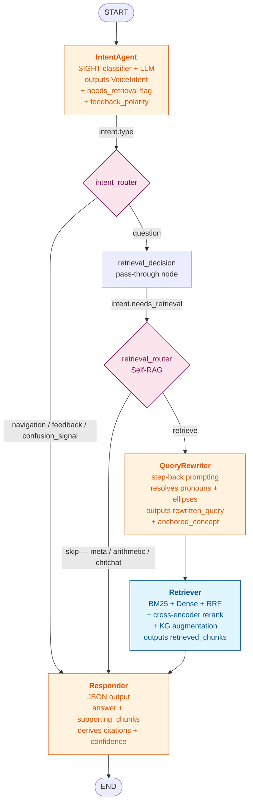

**Key sources:**
- `agentic/qa/graph.py` — graph builder
- `agentic/qa/intent.py` — SIGHT + LLM intent classifier
- `agentic/qa/rewriter.py` — step-back rewriter (Zheng et al. 2023, arXiv:2310.06117)
- `agentic/qa/retriever.py` — RAG + KG augmentation
- `agentic/qa/responder.py` — grounded JSON output

**Self-RAG semantics:**

| Path | Trigger | Latency cost |
|---|---|---|
| `intent_router → short` | navigation / feedback / confusion | 1 LLM call (Responder) |
| `retrieval_router → skip` | needs_retrieval=False (meta question) | 1 LLM call (Responder) |
| `retrieval_router → retrieve` | needs_retrieval=True (factual question) | 3 LLM calls (Rewriter + Responder, retriever is sub-LLM) |

---

## 3. Teaching graph (with reflection fallback)

`agentic/teaching/graph.py:build_teaching_graph` — the LangGraph for
proactive course narration. Implements **self-reflection fallback**
(Asai et al. 2023): when the reviewer rejects the narration after the
retry budget, control transfers to a `FallbackNarrator` that builds a
grounded-by-construction reply rather than silently shipping the
hallucinated draft.

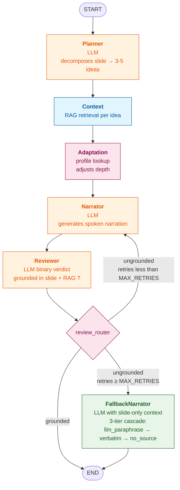

**Fallback cascade** in `agentic/teaching/fallback.py:FallbackNarratorAgent` :

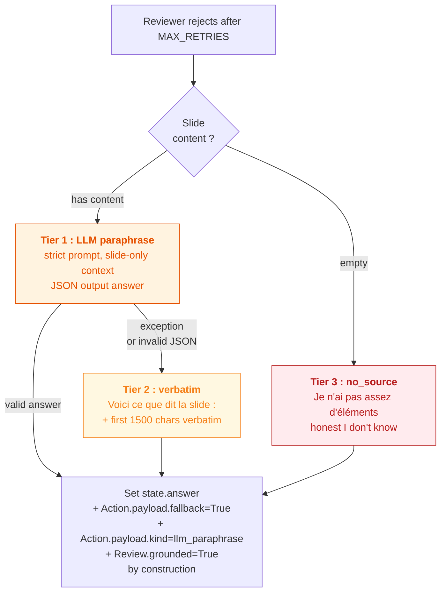

---

## 4. RAG retrieval pipeline

`rag/multimodal_rag.py:MultiModalRAG.retrieve_chunks` — the hybrid
retrieval engine. RRF fusion (Cormack, Clarke & Buettcher 2009) +
cross-encoder rerank + ROUGE-style near-duplicate dedup (Lin 2004).

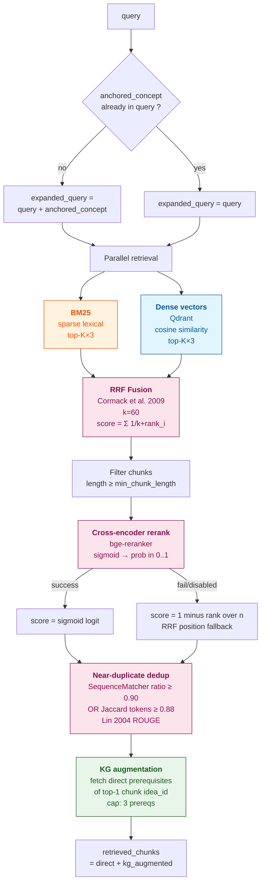

**Citations cited in code comments:**
- Cormack, G. V., Clarke, C. L. A., & Buettcher, S. (2009). *Reciprocal Rank Fusion outperforms Condorcet and individual Rank Learning Methods.* SIGIR'09.
- Lin, C.-Y. (2004). *ROUGE: A Package for Automatic Evaluation of Summaries.* ACL.
- Doignon, J.-P., & Falmagne, J.-C. (1985). *Spaces for the assessment of knowledge.* IJMMS — for KG augmentation.

---

## 5. RAG ingestion pipeline

`pedagogy/intelligent_ingester.py:IntelligentIngester` — drives the
parsing/chunking/indexing flow.

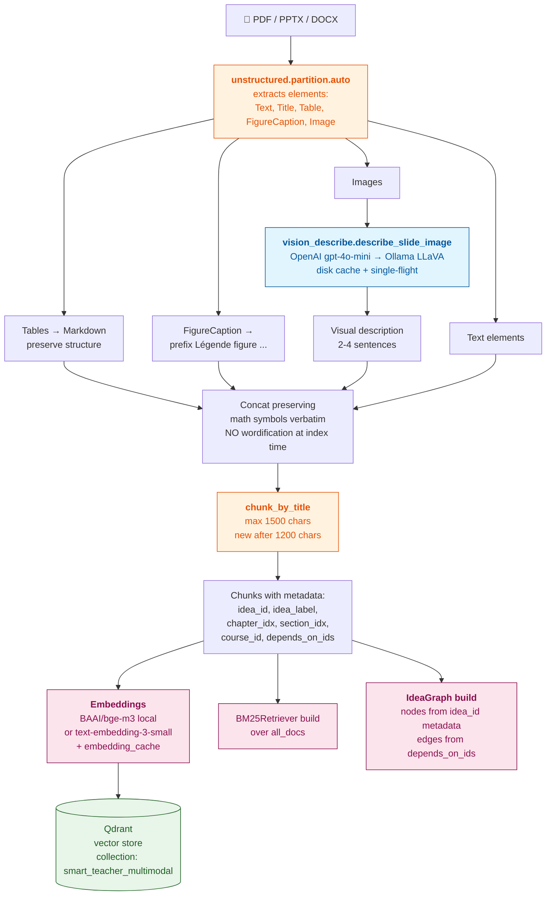

**Why math symbols are preserved at index time** (vs the previous
`_wordify_math` approach): a student searching for `"x²"` finds chunks
containing `"x²"`. Wordifying the symbols at index time destroyed
retrieval precision; verbalization is now done at TTS output time only
(see [section 10](#10-math-handling--index-vs-output-layer)).

---

## 6. TutorState lifecycle

`agentic/state.py:TutorState` — the TypedDict shared between the Q&A
and Teaching graphs. The diagram below shows which agent **writes**
which field, and which agent **reads** it.

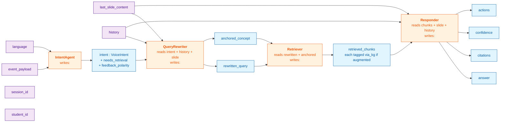

---

## 7. Self-RAG decision tree

How a single utterance is routed through the Q&A graph based on
intent type and the LLM-decided `needs_retrieval` flag.

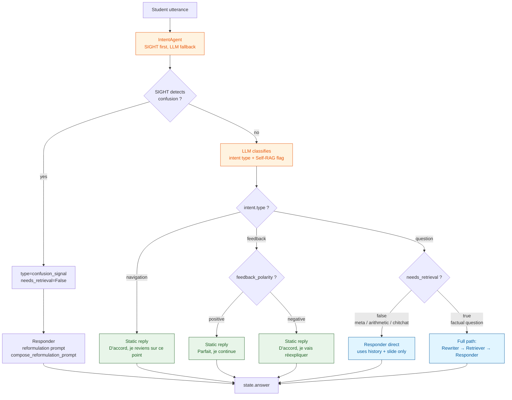

---

## 8. Citation grounding flow

How `state.citations` is populated by the Responder. Implements
hallucination detection: if the LLM didn't cite any chunk, the answer
is flagged as ungrounded (confidence=0.0).

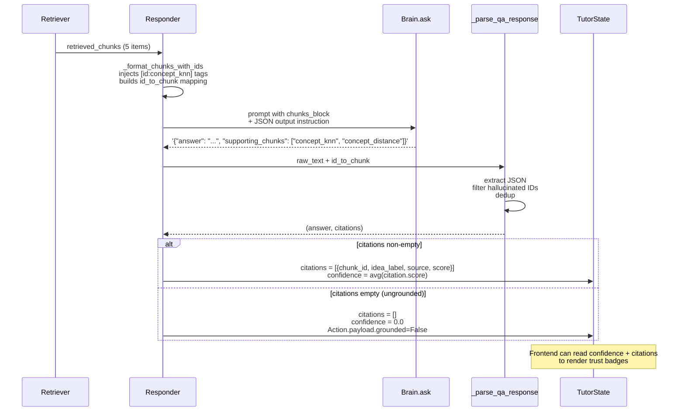

---

## 9. Resilience layers (breaker + OTel + fallback)

`agentic/resilience/wrap.py:build_resilient_node` — wraps every graph
node uniformly. Three concentric layers : circuit breaker → OpenTelemetry
span → exception-to-fallback.

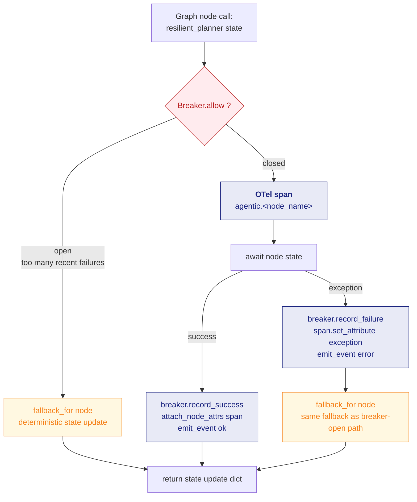

**OTel attributes attached per node** (in `agentic/observability.py:attach_node_attrs`):

| Node | Attributes |
|---|---|
| `intent` | type, confidence, needs_retrieval, feedback_polarity, source |
| `rewriter` | length, anchored_concept |
| `retriever` | chunks_count, kg_augmented_count |
| `responder` | answer_length, citations_count, grounded, confidence, fallback flag |
| `review` | grounded, score |
| `fallback` | kind (llm_paraphrase / verbatim / no_source) |
| `planner` | ideas_count |
| `narrator` | answer_length, retries |
| Generic | output_keys |

---

## 10. Math handling : index vs output layer

Architectural shift from the previous `_wordify_math` design (math
words injected at INDEX time) to the current `audio/math_speech.py`
design (verbalization at OUTPUT time only).

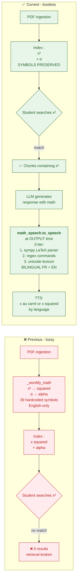

---

## 11. Personalization bandit (Phase 1)

`pedagogy/personalization/bandit/` — contextual Thompson sampling
bandit that selects a pedagogical strategy + speech rate per turn,
based on the student's profile bucket.

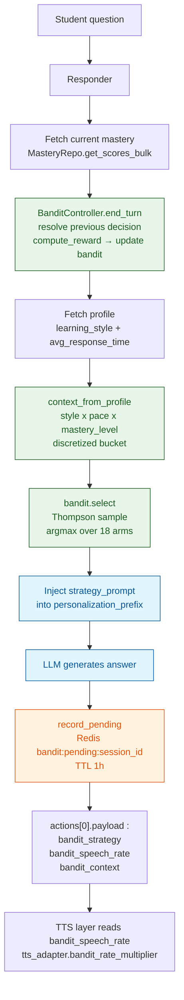

**Action space** : 18 arms = 6 strategies × 3 speech rates.

| Strategy | Description |
|---|---|
| `analogy` | Map concept onto a familiar domain |
| `example` | Worked-out concrete case |
| `decomposition` | Split into sub-concepts (uses IdeaGraph prereqs) |
| `socratic` | Guiding questions before the answer |
| `recap` | Summarize previous concepts before new one |
| `simpler_words` | Plain-language rephrasing |

**Context buckets** : 5 styles × 3 paces × 3 mastery levels = 45 buckets.

**Phases (M2 thesis roadmap)** :

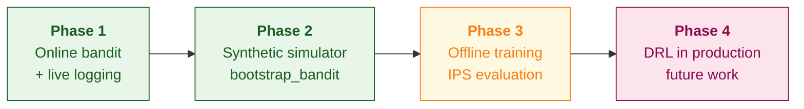

**Reward function** :

```
reward = 0.50 × (1 - confusion_signal)        # Bloom 1968
       + 0.40 × clip(mastery_delta, 0, 0.30)  # Sweller 1985 cognitive load
       + 0.10 × engagement_signal              # tie-breaker
```

**Key files** :
- `bandit/strategies.py` — action space taxonomy
- `bandit/thompson.py` — Beta posterior + Thompson sampling
- `bandit/reward.py` — reward function
- `bandit/repo.py` — Redis persistence + pending decisions (TTL 1h)
- `bandit/controller.py` — start_turn / end_turn lifecycle
- `bandit/simulator.py` — Phase 2 synthetic episodes
- `bandit/offline.py` — Phase 3 offline training + IPS evaluation

**Observability** : `GET /admin/bandit/stats` returns per-bucket arm
distributions, posterior means, and global coverage.

---

## References

Academic citations made by the codebase, each tied to a specific design decision.

| Reference | Used in | Section |
|---|---|---|
| Asai et al. 2023, *Self-RAG* arXiv:2310.11511 | Self-RAG router + reflection fallback | [§2](#2-qa-graph-self-rag), [§3](#3-teaching-graph-with-reflection-fallback), [§7](#7-self-rag-decision-tree) |
| Zheng et al. 2023, *Step-Back Prompting* arXiv:2310.06117 | Rewriter step-back reasoning | [§2](#2-qa-graph-self-rag), [§6](#6-tutorstate-lifecycle) |
| Cormack, Clarke & Buettcher 2009, *RRF outperforms Condorcet…* SIGIR'09 | RRF fusion in retrieval | [§4](#4-rag-retrieval-pipeline) |
| Lin 2004, *ROUGE: A Package…* ACL | Near-duplicate dedup | [§4](#4-rag-retrieval-pipeline) |
| Doignon & Falmagne 1985, *Spaces for the assessment of knowledge* | IdeaGraph + KG-augmented retrieval | [§4](#4-rag-retrieval-pipeline), [§5](#5-rag-ingestion-pipeline) |
| Manning, Raghavan, Schütze 2008, *Introduction to IR* | Recall@K, P@K, F1, MAP | `rag/evaluation/metrics.py` |
| Voorhees 1999, *TREC-8 QA Track Report* | Mean Reciprocal Rank | `rag/evaluation/metrics.py` |
| Järvelin & Kekäläinen 2002, *Cumulated gain-based evaluation…* | nDCG@K | `rag/evaluation/metrics.py` |
| W3C MathML / SSML | math_speech verbalization rules | [§10](#10-math-handling--index-vs-output-layer) |
| Soiffer 2005, *Reading Mathematics* | Linguistics of spoken math | `audio/math_speech.py` |
| GPT-4V (OpenAI 2023) + LLaVA (Liu et al. NeurIPS 2023) | Vision describe providers | [§5](#5-rag-ingestion-pipeline) |
| Nygard 2007, *Release It!* | Circuit breaker pattern | [§9](#9-resilience-layers-breaker--otel--fallback) |
| W3C OpenTelemetry semantic conventions | OTel attribute namespacing | [§9](#9-resilience-layers-breaker--otel--fallback) |
| Russo et al. 2018, *A Tutorial on Thompson Sampling* | Contextual bandit selection | [§11](#11-personalization-bandit-phase-1) |
| Agrawal & Goyal 2013, *Further Optimal Regret Bounds for TS* | Beta-Bernoulli conjugate updates | [§11](#11-personalization-bandit-phase-1) |
| Li et al. 2010, *A contextual-bandit approach to personalized news* | Disjoint contextual bandit pattern | [§11](#11-personalization-bandit-phase-1) |
| Bloom 1968, *Learning for Mastery* | Reward weighting (confusion dominance) | [§11](#11-personalization-bandit-phase-1) |
| Sweller 1985, *Cognitive Load Theory* | Reward weighting (mastery delta) | [§11](#11-personalization-bandit-phase-1) |
| Horvitz & Thompson 1952, *Sampling Without Replacement* | IPS off-policy evaluation | `bandit/offline.py` |
| Dudík, Langford & Li 2011, *Doubly Robust Policy Evaluation* | Phase 3 offline RL methodology | `bandit/offline.py` |
| Swaminathan & Joachims 2015, *Counterfactual Risk Minimization* | Clipped IPS variance reduction | `bandit/offline.py` |

---

## Tooling notes

**To render these diagrams**:

- **GitHub** : automatic, just open this file in the repo.
- **VS Code** : install *Markdown Preview Mermaid Support* extension.
- **Local** : `npm install -g @mermaid-js/mermaid-cli` then
  `mmdc -i ARCHITECTURE.md -o ARCHITECTURE.pdf` to export to PDF for the thesis appendix.
- **Obsidian / MkDocs / GitLab** : built-in Mermaid support.

**To regenerate** : the diagrams are hand-written Mermaid; no auto-extraction is performed. When you change the graph topology, update the relevant section in this file.
